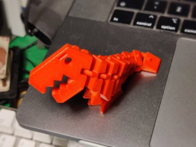
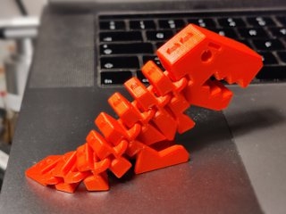
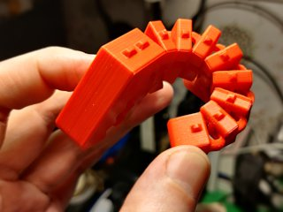

# Flexier Rex
*3D printable print-in-place extra flexible variant of the Flexi Rex*

### License
[Creative Commons - Attribution - Share Alike](https://creativecommons.org/licenses/by-sa/4.0/)

### Attribution
This is another remix of Kirbs' Flexi Rex ([Thingiverse thing:1759297](https://www.thingiverse.com/thing:1759297)), based on airfish's remix ([Thingiverse thing:2189652](https://www.thingiverse.com/thing:2189652)). That model in turn was most likely inspired by the ‘Flexy Rex’ by zheng3 ([Thingiverse thing:929413](https://www.thingiverse.com/thing:929413)).

### Gallery

[🔎](images/flexier1.jpg) [🔎](images/flexier2.jpg) [🔎](images/flexier3.jpg)

## Description and Instructions

This is a variant on the classic Flexi Rex, with some extra play in the shackles. This gives it extra flexibility, particularly in the sideways direction.

The larger slots in the shackles could result in prints of this model being less robust than the original Flexi Rex, so this variant might not be as kid-proof as the original. If you have any problems printing the regular Rex, don't start on this one before you have improved your print settings.

### Licensing

This is published as a straightforward variation on the Flexi Rex, hence it falls under the same *Creative Commons Attribution - Share Alike* license, and the same conditions apply. See the top-level README of the [Flexi Rex repository](https://github.com/DrLex0/print3D-flexirex) for all the details.

### Print Settings I've used

The recommended print settings are the same as for the original Flexi Rex:

* 0.2 mm layers,
* 3 perimeters,
* 15% infill,
* solid infill threshold 8 mm²,
* 5 top layers and 4 bottom layers,
* no supports and no raft needed.
