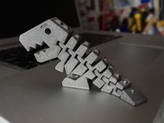
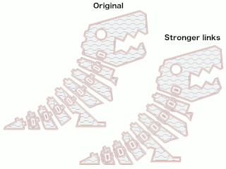
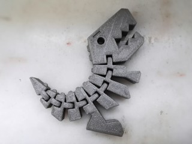
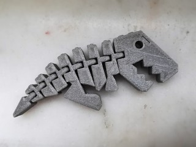
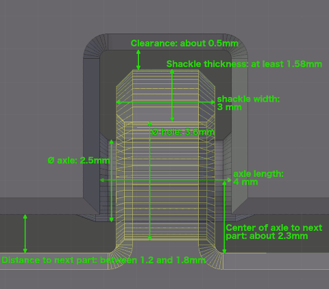

# Flexi Rex with stronger links
*3D printable print-in-place flexible T-rex, with strong links to be more kid-proof (formerly thing:2738211)*

### License
[Creative Commons - Attribution - Share Alike](https://creativecommons.org/licenses/by-sa/4.0/)

### Attribution
This is another remix of Kirbs' Flexi Rex ([Thingiverse thing:1759297](https://www.thingiverse.com/thing:1759297)), based on airfish's remix ([Thingiverse thing:2189652](https://www.thingiverse.com/thing:2189652)). That model in turn was most likely inspired by the ‘Flexy Rex’ by zheng3 ([Thingiverse thing:929413](https://www.thingiverse.com/thing:929413)).

### Gallery

[🔎](images/rex-imp1.jpg) [🔎](images/Rex-comparison.png) [🔎](images/rex-imp2.jpg) [🔎](images/rex-imp3.jpg)

## Description and Instructions

This is the Flexi Rex, which now seems to have joined the club of things anyone having bought a 3D printer ought to print at least once. This is not the first version of this dinosaur. All credit for the original design and appearance goes to [Kirbs](https://www.thingiverse.com/Kirbs/about). My print of Kirbs' model was not very kid-proof however: one of the links broke after some rough handling. Hence in this updated version I made all links more robust. This means this model can probably be printed even smaller than the original ones before the links become too weak. Of course you can also scale it up at will.

‘Dual’ files are also available if you want to do a dual material print with alternating colors.

If you want to make a really huge print, [there is an alternative version](https://github.com/DrLex0/print3D-flexirex-separate) where you can print each segment separately and then assemble it.

If you want to create your own flexible model, make sure to check the **Hinge Design** section below.

### Notice to anyone wanting to sell this

Please read the following before trying to contact me. Most likely the answer to any question you have, is in here. Avoiding to ask questions that have already been answered, will save time both from your and my part.

This model is released under a *Creative Commons - Attribution - Share Alike* license. The details can be [found on the CC website](https://creativecommons.org/licenses/by-sa/4.0/) but in a nutshell it means you are pretty much free to do anything with it including selling prints **if you comply with the following conditions:**

* **‘Attribution’** means you must always provide a visible reference to the origin of the model both on the webpage where you sell the model, and inside the packaging of the actual physical product. A link to the GitHub repository or even just “print3D-FlexiRex by DrLex0 on GitHub” suffices. You should also, and perhaps in the first place, refer to the original model from [Kirbs (thing:1759297)](https://www.thingiverse.com/thing:1759297). A ready-to-print attribution card is included with the downloadable files for this model in PDF format. I don't care how the attribution message is formatted as long as there is no possibility that anyone could believe you are the author of the model because you are selling it. ***This is a very easy requirement*** that doesn't incur any extra cost except a minute of your time. You *do not* need to share any profits¹. If you skip this tiny simple effort and catch enough attention, it might end up costing much more than you gained from it.
* **‘Share Alike’** means that if you make modifications to the 3D model and sell or give away prints based on that modified model, you must publish this modified 3D model and it must be licensed under either the same CC BY-SA license, or a more restrictive license. Of course wherever you publish your modified model, the webpage must also link back to the origin (i.e., this page). Again, this costs you nothing except a few minutes of your time.

If you see this being sold anywhere without the required attribution, don't bother notifying me about it unless it goes far beyond the small scale of a typical Etsy or Facebook store. I don't have the time or means to hunt down all the unscrupulous people who want to make it seem as if they created this model and sell it at an exaggerated price. Moreover my contribution to this design is relatively small: [Kirbs](https://www.thingiverse.com/Kirbs/about) deserves most of the credit. If you do want to spread awareness about this model's true origin on sites where it is sold without attribution, post a comment there and link to this page if possible.

This model contains about 70 cents worth of material when printed in a premium filament. Add to this the costs of electricity and perhaps depreciation of printing infrastructure, and a bit of profit margin, and you might end up with about $2. Anyone who pays much more than that for a print is being ripped off.

(1: Of course you can always [tip me](https://www.dr-lex.be/about/#contact) if you insist on sharing some profits or just want to show some appreciation.)

### Print Settings I've used

0.2 mm layers,
15% infill,
no supports and no raft,
rigid.ink silver ABS

Pretty much any material should work. You could print it in a flexible filament to make it even more flexible and pretty much impossible to destroy, but plain PLA is probably easiest.

No supports needed. I used 3 perimeters to ensure the hinges are strong, this is much preferred over trying to obtain strength through infill. If you use too high infill, the model may become poorly balanced due to the head being too heavy. If you want to improve stability, use a higher infill for the piece with the legs if you can.

If you have problems with parts curling up and the print head knocking them over, try to apply more cooling (but don't exaggerate, because too much cooling will result in a weaker print).

This should move freely right after you take it off the build plate. If you print ABS with hairspray on a glass bed, the Rex will likely spontaneously jump into a random pose all by itself when it pops off the plate after cooling down. If you need to use force to free the hinges, you still have some optimization work to do on your printing technique.

This is not a demanding print. If this is one of the first things you're printing and it fails, expect other things to fail as well.

## Remarks

* This model was designed using a mesh-based program. Mesh-based models cannot be generally converted into a volume-based representation as used by technical CAD programs, so please don't ask me for a STEP file or whatever other CAD format of this model, because there is none. If you want to modify the model, the most sensible approach is to use a mesh-based editor.

## Hinge Design

If you want to create your own flexible model, **by all means copy the hinge design from this one, or at least use the hinge dimensions image as a guideline.** I see way too many ‘flexi’ models that still use the weak hinge design from the original model, or other shapes that have way too little material in the most crucial locations, often the end of the shackle or ‘ring’ is too thin. Make sure to provide as much material around the axle hole as possible, instead of cutting away as much as possible as some designers tend to do. You won't gain any flexibility by providing more clearance than needed, the model will only become weaker.

 
[Hinge dimensions (🔎 view larger image)](images/Hinge_dimensions.png)

## TAGS
`dinosaur`, `flexible`, `print_in_place`, `t-rex`, `toy`, `Tyrannosaurus_Rex`
